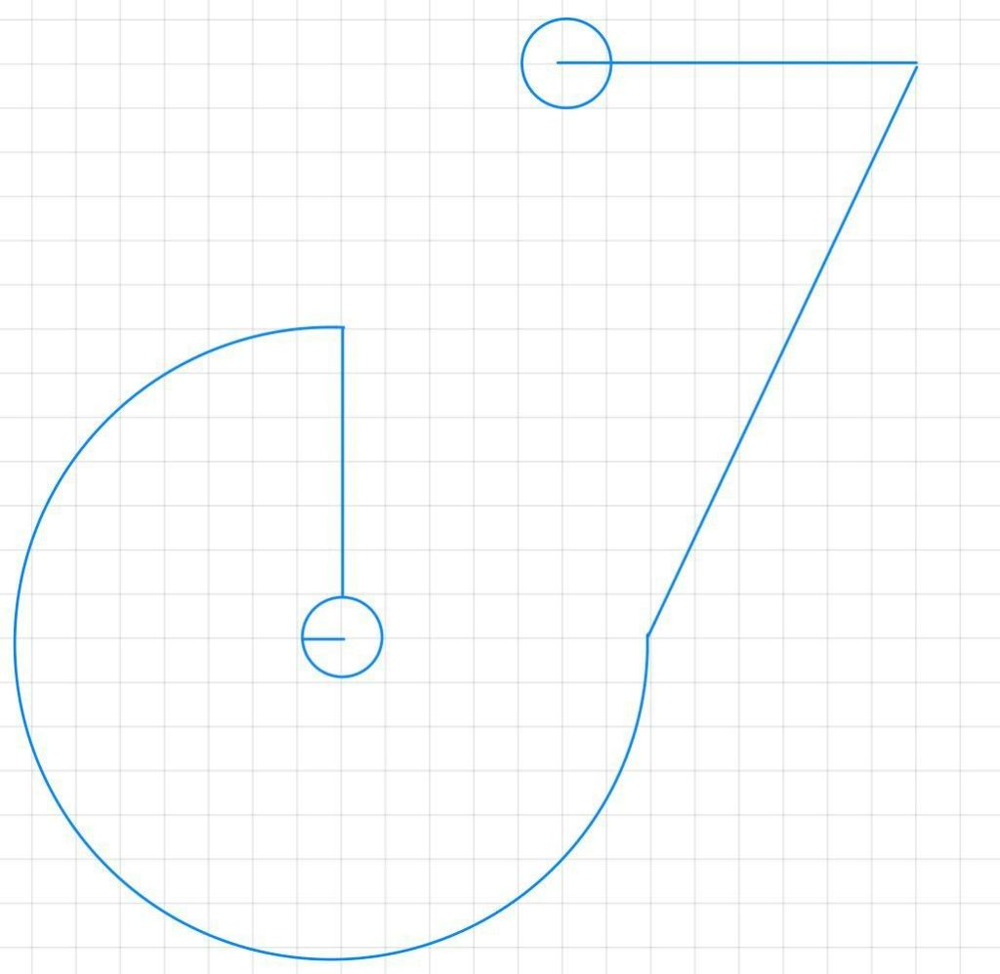

Aufgabe 1 (15%) Sensoren

1. Nennen Sie außer Sonar- & Lasersensoren drei weitere Sensoren welche im stillstehenden Zustand des Roboters den Abstand zu einem metallischen Objekt messen können.
2. 12 Messwerte gegeben, Ausreißer finden und ersetzen mit Medianfilter. Fenstergröße 7, die Toleranz für Abweichungen ist 5. (4 stellige Zahlen)
3. Es geht um ein Segment im Occupancy Grid. Sonarsensor erkennt es mit einer Wahrscheinlichkeit von 0.4 als frei, der Laser zu 0.4 als belegt. Unsicherheit ist bei beiden Sensoren 0.35. Berechnen Sie die Wahrscheinlichkeit, mit der das Segment belegt ist.
4. In welcher Situation findet man mit der Potenzialfeldmethode keine Route, obwohl es eine gibt? Zeichnen Sie eine Karte mit Hindernissen, Startpunkt und Ziel. Erklären Sie, warum keine Route gefunden werden kann.

Aufgabe 2 (15%) Direktsteuerung 1

DX9 Roboter soll von oberen Punkt zu dem Punkt in dem Kreis fahren. 1 Kästchen = 20x20cm, Geschwindigkeit 200mm/s. Methode a2 für Robcon Skript entwickeln.

Winkel z.B. mit Cosinus berechnen, Diagonale mit Pythagoras, Kreisumfang mit Pi

Aufgabe 3 (15%) Direktsteuerung 2

Roboter mit fehlerfreier Odometrie navigieren

(Skizze)

Aufgabe 4 Fuzzy Logik

1. Es gibt ein Fuzzy Set die die Lage eines Objekts im Kamerabild beschreibt. Dabei gibt es die ling. Variablen außen links, links, mittig, rechts, außen rechts. Der Bereich reicht von -20 bis 20grad. 
2. Das zweite Fuzzy Set beschreibt die Entfernung zum Objekt. Nah ist unter 2m, Fern ist über 6m Distanz. 
3. Das dritte FuzzySet beschreibt die Drehung des Roboters in eine Richtung. Der Bereich geht von -30 bis 30 Grad. Die ling Variablen sind scharf links, links, mittig, rechts, scharf rechts.
4. Regler entwickeln  
   if xyz and qwe then asd
5. Fuzzyfizierung der Regler 12 Grad gemessen und Distanz

Aufgabe 5 (40%) Behaviours

Roboter (rechts) soll die Linie entlang fahren und im Kreis (links) anhalten, aber nur wenn die Kamera das blaue Schild an der Wand sieht. Schwellwert für Kamera und Toleranz für Spurkorrektur (10px?) sind gegeben. Wenn die Spur am Boden endet, soll das Programm mit einem Fehler beendet werden. Behaviour MoveLine: Der Roboter soll entlang der Linie eine (gegebene) Distanz fahren und dann anhalten. Behaviour FindSign: Nach jedem Stopp sucht die Kamera nach dem Schild. Die Kamera ist bereits in die richtige Richtung gedreht.

1. Zeichnen Sie einen endlichen Zustandsautomaten der Strategie. Beschriften Sie die Ecken der Zustände mit den Resultaten der Behaviours. Die Strategie muss nicht implementiert werden.
2. Implementieren Sie das Behaviour MoveLine.
3. Implementieren Sie das Behaviour FindSign.