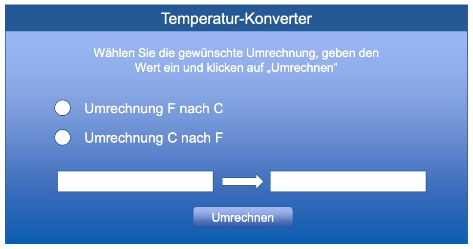

Dozent: Christian Sturm

- Was ist der False Consensus Effekt und was bedeutet er für Designentscheidungen?
- Zeige das Modell des Langzeitgedächtnisses auf und erkläre die einzelnen Bestandteile. Es soll ein Videospiel entwickelt werden bei dem neue Welten erkundet werden sollen. Welche Designentscheidungen treffen Sie? Erklären Sie anhand der Strukturen des Langzeitgedächtnis
- Ergonomie: Nennen Sie 4 technisches Belastungen die bei VR Anwendungen beachtet werden sollten.
- Im Arbeitsgedächtnis gibt es den visuell-räumlichen Notizblock, den episodischen Puffer und den phonologischen Puffer, erkläre anhand eines Beispiels wie diese zusammenarbeiten.
- Was bedeutet die laterale Hemmung für die Wahrnehmung in der Dunkelheit?
- Warum reichen 12,5fps für ein Video aus?
- Erkläre das Beanspruchungsmodell.
- Was hat die Lichttemperatur mit der Leistungsfähigkeit zu tun? 
- Wende die 3 Lernansätze (Behaviorismus, Kognitiver und Konstruktivistischer Ansatz) auf .... an (Frage: Wie kann man Menschen vermitteln, dass Gesunde Ernährung wichtig ist?) 
- Stell dir vor du sollst eine H&M Filiale in einem Einkaufszentrum gestalten. 
  - Wie sollte die Ladenzeile aussehen um Aufmerksamkeit zu erregen und Personen dazu motivieren in die Filiale zu kommen? Erkläre dies mit der Filtertheorie von Broadbent. 3 Features/Ideen.
  - Wie würdest du die Customer Experience für die vers. Motivklassen gestalten? Beziehen Sie die Motivationalen Komponenten von Emotionen mit ein. (3 Features)
- Stell dir vor du sollst ein deutsches Auto in Korea releasen. Welche Dinge würdest du nach dem TLCC Modell anpassen? (pro Topic zwei Änderungen)
- Eine Informationsarchitektur für eine neue globale Webseite soll entwickelt werden. Zwei Beispiele nennen, wie man darauf schließen kann, was in anderen Kulturen dafür wichtig ist. (keine Kulturvariablen) 
- Zwei UIs (Teil der Vorlesung gewesen unter GOMS - °F zu °C Umrechner). Erklären Sie mit GOMS, Fitts und/oder Hicks Law warum das untere effektiver ist. 

  

  
- Der Mensch sieht 60 Linien scharf. Nennen sie Beispiele zur Umsetzung in den Bereichen Wirtschaft, Technik und Gestaltung.